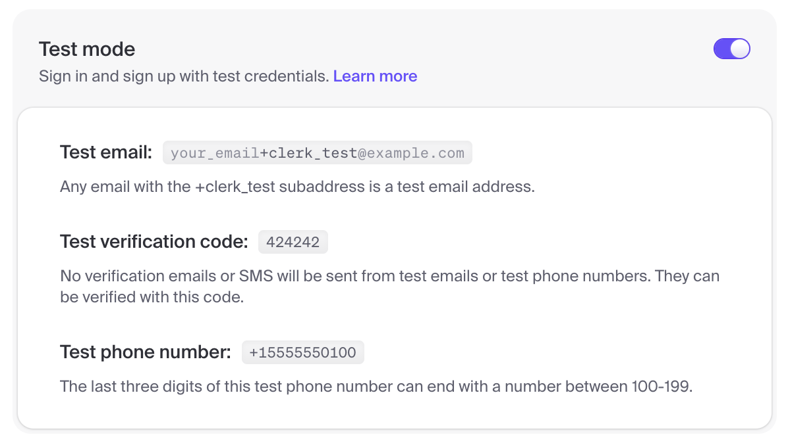
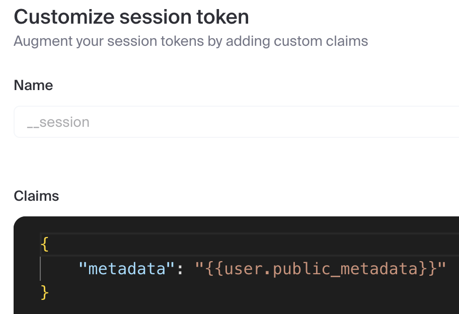
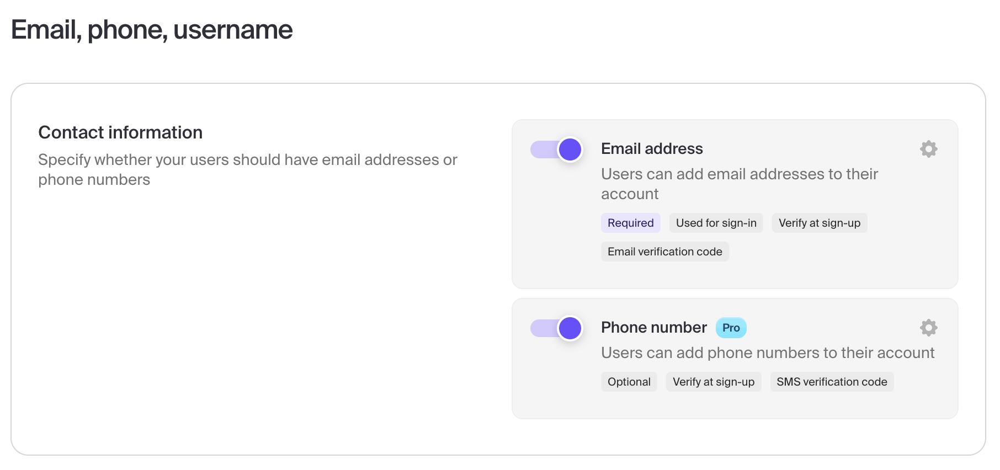

## Payload and Clerk example

This is an example for integrating [Payload CMS](https://payloadcms.com) with [Clerk](https://clerk.com) in a Next.js App Router application. Clerk handles sign-in and user identity, Payload uses the Clerk session through a custom auth strategy, and Clerk webhooks keep Payload's user collection in sync.

The current version uses Next.js 16, React 19, TypeScript 6, Tailwind CSS v4, Clerk, Payload CMS 3, and Postgres.

## Contents

- [YouTube videos](#youtube-videos)
- [Getting Started](#getting-started)
- [Database](#database)
- [Webhooks](#webhooks)
- [E2E Testing](#e2e-testing)
- [Useful scripts](#useful-scripts)

## YouTube videos

**Part 2 - Advanced integration**

[](https://www.youtube.com/watch?v=egKaeOuddFA)

[https://www.youtube.com/watch?v=egKaeOuddFA](https://www.youtube.com/watch?v=egKaeOuddFA)

Source code for the video is in the `part-2` branch: https://github.com/DanailMinchev/payload-clerk-example/tree/feat/part-2

**Part 1 - Basic integration**

[](https://www.youtube.com/watch?v=7PNGNqqFlu0)

[https://www.youtube.com/watch?v=7PNGNqqFlu0](https://www.youtube.com/watch?v=7PNGNqqFlu0)

Source code for the video is in the `part-1` branch: https://github.com/DanailMinchev/payload-clerk-example/tree/feat/part-1

## Getting Started

Install dependencies:

```shell
npm ci
```

Copy the environment template:

```shell
cp env.example .env.local
```

Create a new Clerk application and enable `Email` as a sign-in option. For local testing, enable Clerk test mode:



Configure the Clerk session token to include user public metadata:



```json
{
  "metadata": "{{user.public_metadata}}"
}
```

Set these Clerk environment variables in `.env.local`:

- `NEXT_PUBLIC_CLERK_PUBLISHABLE_KEY`: your Clerk publishable key.
- `CLERK_SECRET_KEY`: your Clerk secret key. Keep this server-only.
- `CLERK_WEBHOOK_SIGNING_SECRET`: the webhook endpoint signing secret from Clerk.
- `NEXT_PUBLIC_CLERK_SIGN_IN_URL=/login`
- `NEXT_PUBLIC_CLERK_SIGN_UP_URL=/registration`
- `NEXT_PUBLIC_CLERK_SIGN_IN_FALLBACK_REDIRECT_URL=/`
- `NEXT_PUBLIC_CLERK_SIGN_UP_FALLBACK_REDIRECT_URL=/`

Set these local Postgres environment variables in `.env.local`:

- `POSTGRES_DB=payload_clerk_example`
- `POSTGRES_USER=payload`
- `POSTGRES_PASSWORD=payload`
- `POSTGRES_HOST=127.0.0.1`
- `POSTGRES_PORT=5432`

Set these Payload environment variables in `.env.local`:

- `DATABASE_URL=postgresql://$POSTGRES_USER:$POSTGRES_PASSWORD@$POSTGRES_HOST:$POSTGRES_PORT/$POSTGRES_DB`
- `PAYLOAD_SECRET`: a long random secret used by Payload.

`DATABASE_URL` reuses the local Postgres variables above. If your password contains URL-reserved characters, percent-encode it in `DATABASE_URL`.

Start the local Postgres service:

```shell
docker compose --env-file .env.local up -d postgres
```

Run the development server:

```shell
npm run dev
```

Open [http://localhost:3000](http://localhost:3000). The main routes are:

| Path                      | Type                  | Notes                                                   |
| ------------------------- | --------------------- | ------------------------------------------------------- |
| `/`                       | Public                | Landing page                                            |
| `/login/*`                | Public                | Custom catch-all hosting Clerk `<SignIn />`             |
| `/registration/*`         | Public                | Custom catch-all hosting Clerk `<SignUp />`             |
| `/profile/*`              | **Protected** (Clerk) | Catch-all hosting Clerk `<UserProfile />`               |
| `/admin/*`                | **Protected** (Clerk) | Payload admin catch-all                                 |
| `/admin/clerk-users`      | **Protected** (Clerk) | Super-admin Clerk user role management                  |
| `/api/[...slug]`          | Public                | Payload REST API with collection access control         |
| `/api/graphql`            | Public                | Payload GraphQL endpoint                                |
| `/api/graphql-playground` | Public                | GraphiQL playground                                     |
| `/api/webhooks/clerk`     | Public POST           | Clerk webhook receiver                                  |
| `/api/app/seed`           | Protected POST        | Non-production seed endpoint; super-admin role required |

Clerk protection is enforced in `src/proxy.ts` for `/admin(.*)`, `/profile(.*)`, and `/api/app/seed(.*)`. Unauthenticated page requests redirect to `/login`; unauthenticated protected API requests return `401`.

### Local test users

For testing and local development, the seed flow uses these Clerk users:

- `all-roles-1+clerk_test@example.com`
- `super-admin-1+clerk_test@example.com`
- `admin-1+clerk_test@example.com`
- `editor-1+clerk_test@example.com`
- `user-1+clerk_test@example.com`

Set their passwords in `.env.local`:

```dotenv
E2E_CLERK_ALL_ROLES_USER_EMAIL=all-roles-1+clerk_test@example.com
E2E_CLERK_ALL_ROLES_USER_PASSWORD=
E2E_CLERK_ALL_ROLES_USER_PHONE=

E2E_CLERK_SUPER_ADMIN_USER_EMAIL=super-admin-1+clerk_test@example.com
E2E_CLERK_SUPER_ADMIN_USER_PASSWORD=
E2E_CLERK_SUPER_ADMIN_USER_PHONE=

E2E_CLERK_ADMIN_USER_EMAIL=admin-1+clerk_test@example.com
E2E_CLERK_ADMIN_USER_PASSWORD=
E2E_CLERK_ADMIN_USER_PHONE=

E2E_CLERK_EDITOR_USER_EMAIL=editor-1+clerk_test@example.com
E2E_CLERK_EDITOR_USER_PASSWORD=
E2E_CLERK_EDITOR_USER_PHONE=

E2E_CLERK_AUTHENTICATED_USER_EMAIL=user-1+clerk_test@example.com
E2E_CLERK_AUTHENTICATED_USER_PASSWORD=
E2E_CLERK_AUTHENTICATED_USER_PHONE=
```

If you want the seed flow to create phone numbers too, enable phone numbers in the Clerk dashboard and fill the `E2E_CLERK_*_USER_PHONE` variables. Otherwise, leave them empty.



To bootstrap role management manually, create `super-admin-1+clerk_test@example.com` in Clerk and set this public metadata:

```json
{
  "roles": ["super-admin"]
}
```

After signing in as that super-admin, open `/admin`. In non-production environments the dashboard shows a `Seed your database` button for super-admins. It calls `POST /api/app/seed`, deletes local posts/media and the configured E2E Clerk users, then recreates the E2E users with these roles:

- `all-roles-1+clerk_test@example.com`: `super-admin`, `admin`, `editor`
- `super-admin-1+clerk_test@example.com`: `super-admin`
- `admin-1+clerk_test@example.com`: `admin`
- `editor-1+clerk_test@example.com`: `editor`
- `user-1+clerk_test@example.com`: no role

You can also create the users manually and manage their roles from `/admin/clerk-users`.

## Database

Local development and production both use Postgres through `@payloadcms/db-postgres`. Payload reads the Postgres connection from `DATABASE_URL`.

For local development, `compose.yaml` defines a Postgres service with a named Docker volume for database state. The default local connection is:

```dotenv
DATABASE_URL=postgresql://$POSTGRES_USER:$POSTGRES_PASSWORD@$POSTGRES_HOST:$POSTGRES_PORT/$POSTGRES_DB
```

`env.example` is the project environment template. It includes these local Docker Compose defaults:

```dotenv
POSTGRES_DB=payload_clerk_example
POSTGRES_USER=payload
POSTGRES_PASSWORD=payload
POSTGRES_HOST=127.0.0.1
POSTGRES_PORT=5432
```

For local `.env.local` files, `DATABASE_URL` reuses those values through environment-variable expansion. In production, prefer setting `DATABASE_URL` directly to the managed Postgres connection string from your host or database provider. The `POSTGRES_*` variables are only needed in production if your deployment environment expands `DATABASE_URL` from them and you choose to configure it that way.

If port `5432` is already in use, set `POSTGRES_PORT` to another host port before starting the local service:

```shell
POSTGRES_PORT=5433 docker compose --env-file .env.local up -d postgres
```

```dotenv
POSTGRES_PORT=5433
```

Payload migrations live in `src/migrations`. Run migrations before production builds or deploys:

```shell
npm run payload:migrate
```

Payload CLI scripts load Next-style env files with dotenvx, so local commands read `.env.local` and deployed environments can use real environment variables.

To reset only the local Docker database, stop the compose service and remove its named volume:

```shell
docker compose down -v
```

## Webhooks

The app exposes `POST /api/webhooks/clerk`, implemented in `src/app/(frontend)/api/webhooks/clerk/route.ts`.

In Clerk, create a webhook endpoint with this URL:

```text
https://<your-tunnel-or-production-host>/api/webhooks/clerk
```

Subscribe to these events:

- `user.created`
- `user.updated`
- `user.deleted`

Copy the endpoint signing secret into `.env.local` as `CLERK_WEBHOOK_SIGNING_SECRET`.

For local webhook testing with ngrok, run one of these commands and use the generated/static ngrok URL in Clerk:

```shell
ngrok http 3000 --url={NGROK_DOMAIN}
```

```shell
docker run -it -e NGROK_AUTHTOKEN={NGROK_AUTHTOKEN} ngrok/ngrok:latest http host.docker.internal:3000 --url={NGROK_DOMAIN}
```

Replace `{NGROK_AUTHTOKEN}` with your ngrok authtoken and `{NGROK_DOMAIN}` with your ngrok domain.

## E2E Testing

There are E2E tests implemented using [Playwright](https://playwright.dev/).

They are split into two categories:

- `api-tests`: verify Payload REST API access control.
- `app-tests`: verify application pages, including protected routes.

Before running them for the first time, install Playwright browsers:

```shell
npx playwright install
npx playwright install-deps
```

The E2E tests require the `E2E_CLERK_*` environment variables in `.env.local`.

Run E2E tests:

```shell
npm run playwright:test
```

Run E2E tests in debug mode:

```shell
npm run playwright:test:debug
```

Run E2E tests in UI mode:

```shell
npm run playwright:test:ui
```

## Useful scripts

```shell
npm run dev
npm run build
npm run start
npm run lint
npm run typecheck
npm test -- --run
npm run format
npm run format:ci
npm run payload:migrate:create -- <name>
npm run payload:migrate
npm run payload:migrate:status
npm run payload:generate:types
npm run payload:generate:importmap
npm run update:dependencies
npm run update:skills
```

`npm run dev` and `npm run build` use the default Next.js Turbopack flow.
