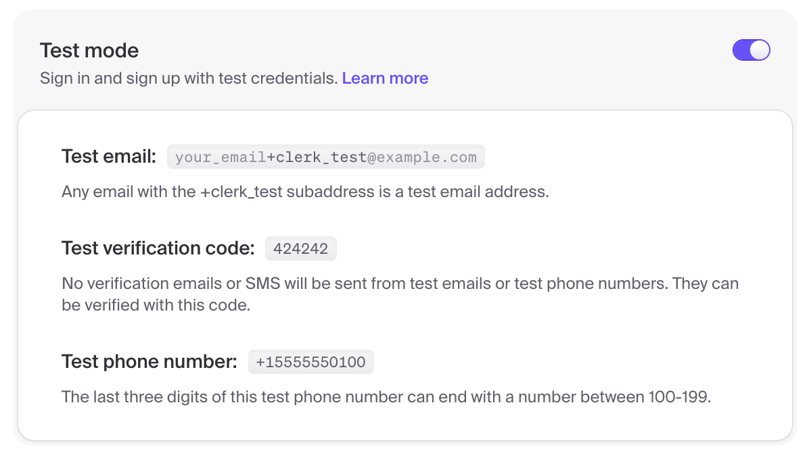
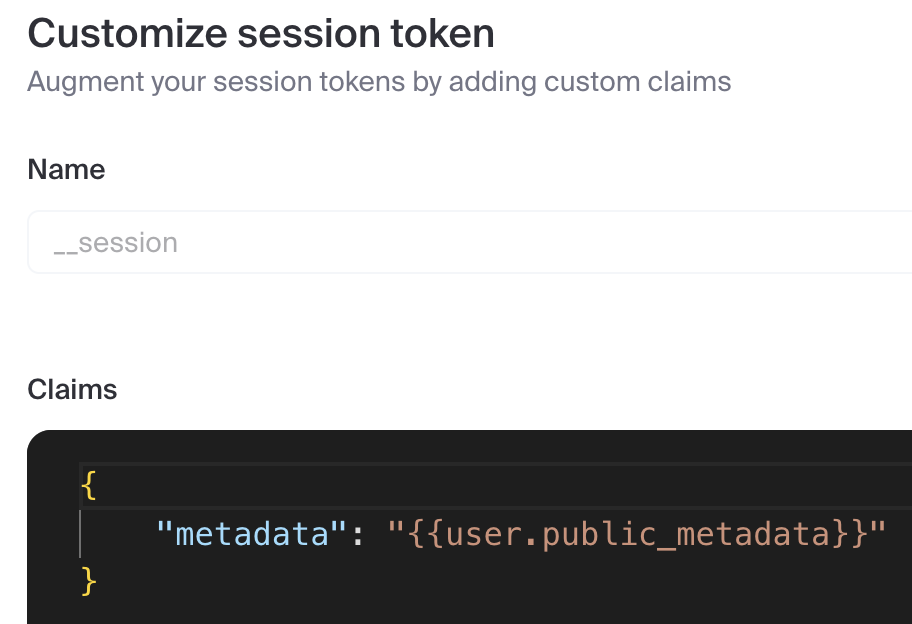
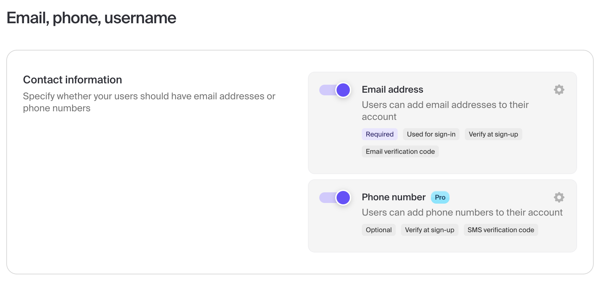

## Payload and Clerk example

This is an example for Payload CMS and Clerk integration.

YouTube videos:

**PART 1**

[](https://www.youtube.com/watch?v=7PNGNqqFlu0)

[https://www.youtube.com/watch?v=7PNGNqqFlu0](https://www.youtube.com/watch?v=7PNGNqqFlu0)

Source code in the `part-1` branch: https://github.com/DanailMinchev/payload-clerk-example/tree/feat/part-1

## Getting Started

1. Create a new Clerk application and configure:

Enable `Email` as `Sign in option`.

The setup is described in details in the videos above, but here are the settings for reference:

- [Test mode](https://clerk.com/docs/testing/test-emails-and-phones#setup-test-mode)
  

- [publicMetadata](https://clerk.com/docs/references/nextjs/basic-rbac)
  

2. Copy the `env.example` file into `.env.local` file.

3. Set Clerk environment variables [documentation](https://clerk.com/docs/deployments/clerk-environment-variables):

`NEXT_PUBLIC_CLERK_PUBLISHABLE_KEY`

Your Clerk app's Publishable Key, which you can find in the Clerk Dashboard. It will be prefixed with pk*test* in
development instances and pk*live* in production instances.

`CLERK_SECRET_KEY`

Your Clerk app's Secret Key, which you can find in the Clerk Dashboard. It will be prefixed with sk*test* in development
instances and sk*live* in production instances. Do not expose this on the frontend with a public environment variable.

`SIGNING_SECRET`

In case you are going to use [Webhooks](https://clerk.com/docs/webhooks/sync-data), you will need to set Signing Secret.

4. Set Payload environment variables [documentation](https://payloadcms.com/docs/getting-started/installation)

`PAYLOAD_SECRET`

This environmental variable acts as your secret key. It's paramount that you ensure its value is both secure and strong,
as it's integral to the encryption and decryption process.

`DATABASE_URI`

This is the database connection string. Uncomment `DATABASE_URI` for `SQLite` or `PostgreSQL`.

5. If you selected the `PostgreSQL` you can use Docker:

```bash
docker compose up
```

and edit the `src/payload.config.ts` file:

Uncomment:

```typescript
import { postgresAdapter } from "@payloadcms/db-postgres";
```

Comment / delete:

```typescript
import { sqliteAdapter } from "@payloadcms/db-sqlite";
```

Uncomment:

```typescript
  // PostgreSQL
db: postgresAdapter({
  pool: {
    connectionString: process.env.DATABASE_URI || "",
  },
}),
```

Comment / delete:

```typescript
  // SQLite
db: sqliteAdapter({
  client: {
    url: process.env.DATABASE_URI || "",
  },
}),
```

6. For testing and local development purposes following users are being used:

- all-roles-1+clerk_test@example.com
- super-admin-1+clerk_test@example.com
- admin-1+clerk_test@example.com
- editor-1+clerk_test@example.com
- user-1+clerk_test@example.com

Please set the environment variables accordingly with their passwords in your `.env.local` file:

```dotenv
E2E_CLERK_ALL_ROLES_USER_EMAIL=all-roles-1+clerk_test@example.com
E2E_CLERK_ALL_ROLES_USER_PASSWORD=
E2E_CLERK_ALL_ROLES_USER_PHONE=+19735550101

E2E_CLERK_SUPER_ADMIN_USER_EMAIL=super-admin-1+clerk_test@example.com
E2E_CLERK_SUPER_ADMIN_USER_PASSWORD=
E2E_CLERK_SUPER_ADMIN_USER_PHONE=+19735550102

E2E_CLERK_ADMIN_USER_EMAIL=admin-1+clerk_test@example.com
E2E_CLERK_ADMIN_USER_PASSWORD=
E2E_CLERK_ADMIN_USER_PHONE=+19735550103

E2E_CLERK_EDITOR_USER_EMAIL=editor-1+clerk_test@example.com
E2E_CLERK_EDITOR_USER_PASSWORD=
E2E_CLERK_EDITOR_USER_PHONE=+19735550104

E2E_CLERK_AUTHENTICATED_USER_EMAIL=user-1+clerk_test@example.com
E2E_CLERK_AUTHENTICATED_USER_PASSWORD=
E2E_CLERK_AUTHENTICATED_USER_PHONE=+19735550105
```

The above users are using test emails and test phone numbers as described in [Test emails and phones](https://clerk.com/docs/testing/test-emails-and-phones).

If you want to use phone numbers, you need to enable "Phone number" in the Clerk's dashboard, otherwise seed endpoint will not work.



Otherwise, leave the `E2E_CLERK_*_USER_PHONE` environment variables empty.

7. Register the `E2E` users.

You can register the `E2E` users from the above point manually or automatically using the `GET /api/app/seed` endpoint.

**Registering automatically**

Run the application: `npm run dev`

Invoke / navigate to [http://localhost:3000/api/app/seed](http://localhost:3000/api/app/seed) endpoint.

Observe the console for logs.

**WARNING: the endpoint will delete your existing data**

**Registering manually**

You should register your `super-admin-1+clerk_test@example.com` user in Clerk manually and set the `super-admin` role.

The `super-admin-1+clerk_test@example.com` user should have following [public metadata](https://clerk.com/docs/users/metadata#public-metadata):

```json
{
  "roles": ["super-admin"]
}
```

and you should set the rest of the user roles via the [admin dashboard](http://localhost:3000/admin/clerk-users) as follows:

- all-roles-1+clerk_test@example.com (super-admin role, admin role, editor role)
- admin-1+clerk_test@example.com (admin role)
- editor-1+clerk_test@example.com (editor role)
- user-1+clerk_test@example.com (no role, no changes to user's metadata, used for simulating a website user / registered
  user)

8. Run the development server:

```bash
npm run dev
```

Open [http://localhost:3000](http://localhost:3000) with your browser to see the result.

## Webhooks

Please refer to the official documentation - [Sync Clerk data to your app with webhooks](https://clerk.com/docs/webhooks/sync-data).

The app exposes `POST /api/clerk/webhooks` endpoint which can be configured in
the [Clerk Dashboard](https://dashboard.clerk.com/last-active?path=webhooks).

Environment variables:

- `SIGNING_SECRET` : "Signing Secret" from the [Clerk Dashboard](https://dashboard.clerk.com/last-active?path=webhooks).

Currently, the webhooks endpoint is listening on the following events:

- `user.created`
- `user.updated`
- `user.deleted`

### Testing webhooks with ngrok

Please follow the official documentation - [Setup & Installation](https://dashboard.ngrok.com/get-started/setup)

To run ngrok in Docker (macOS):

```shell
docker run -it -e NGROK_AUTHTOKEN={NGROK_AUTHTOKEN} ngrok/ngrok:latest http host.docker.internal:3000 --url={NGROK_DOMAIN}
```

To run ngrok in Docker (other OS):

```shell
docker run -it -e NGROK_AUTHTOKEN={NGROK_AUTHTOKEN} ngrok/ngrok:latest http 3000 --url={NGROK_DOMAIN}
```

To run ngrok using native binary:

```shell
ngrok http 3000 --url={NGROK_DOMAIN}
```

Replace `{NGROK_AUTHTOKEN}` with [your authtoken](https://dashboard.ngrok.com/get-started/your-authtoken).

Replace `{NGROK_DOMAIN}` with [your free static domain](https://dashboard.ngrok.com/domains),
for example: `your-static-domain-here.ngrok-free.app`.
